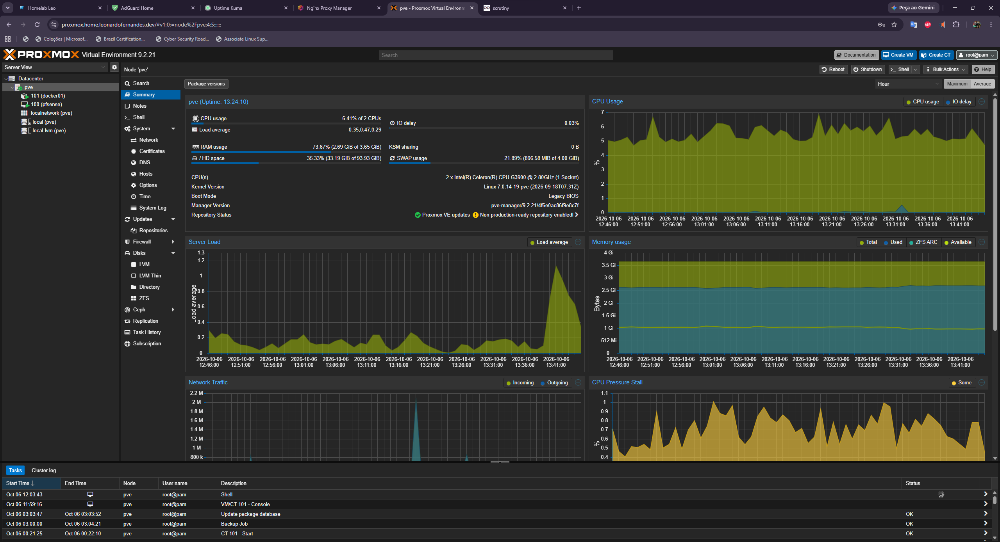
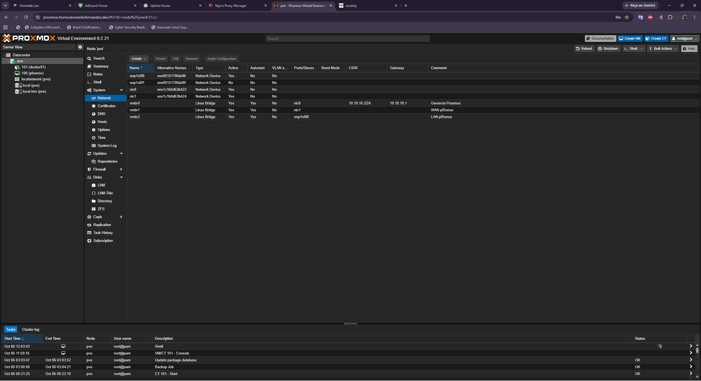
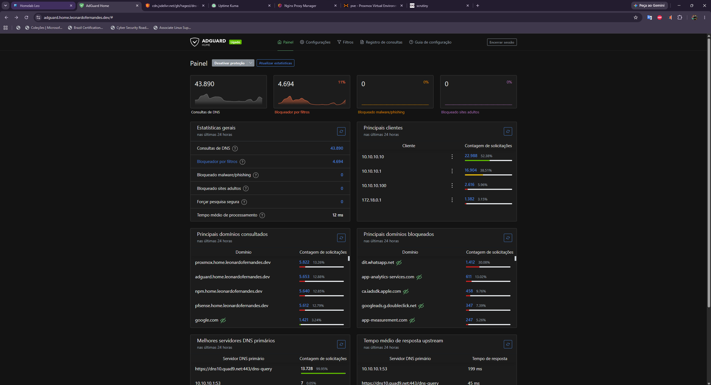
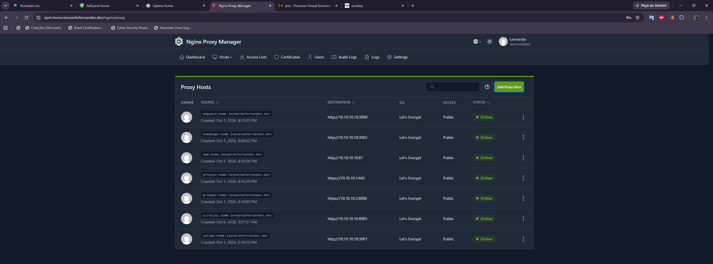
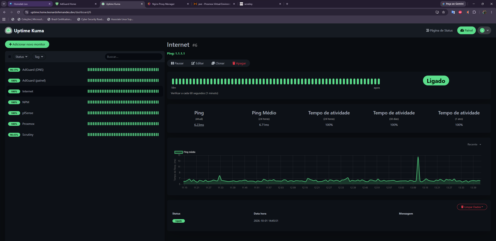
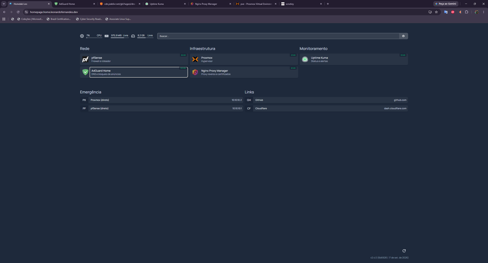

# Homelab

This is my home lab. It started as an old desktop sitting around doing nothing, and turned into a full networking, security and self-hosting setup that I use to learn and to run a few services at home.

Everything here runs on a single machine. The goal was never to have the most powerful rig, it was to understand how the pieces fit together: virtualization, firewalling, DNS, reverse proxy, remote access, monitoring. I document it mostly so my future self remembers why I did things a certain way, but also so other people can follow along.

## What it runs on

The hardware is intentionally modest. Part of the fun was seeing how much you can do with little.

- Intel Celeron G3900
- Gigabyte H170N-WiFi
- 4 GB RAM (the real bottleneck, more on that below)
- Kingston NVMe 500 GB
- 8-port switch and a dual-port Intel NIC on top of the two onboard ports

## How it's laid out

Proxmox VE is the base. On top of it:

- **pfSense** runs as a VM and is the brain of the network. It does the firewall, DHCP and DNS resolving, and separates the WAN (from the ISP) from the internal LAN.
- An **unprivileged LXC container** (`docker01`) holds the Docker stack with all the services.

The NICs are split on purpose: one onboard port is only for the Proxmox management interface, the other is the pfSense WAN, and one port of the dual NIC is the pfSense LAN. The last port is reserved for a future access point.

```
Internet
   |
 ISP ONU
   |
 pfSense (VM)  ──  firewall / DHCP / DNS
   |
 Switch
   |
 docker01 (LXC)  ──  AdGuard, NPM, Uptime Kuma, Homepage, Scrutiny
```

Proxmox running the pfSense VM and the docker01 container side by side, on the Celeron with 4 GB of RAM:



The network config, showing the bridges split by role (management, pfSense WAN, pfSense LAN):



## The stack

### Network and DNS
pfSense handles routing and the firewall. **AdGuard Home** is the DNS for the whole network, and the DNS traffic is forced to it with a NAT rule, so no device can skip the filter just by changing its DNS manually. On top of the default list I run HaGeZi Multi to block ads, trackers, malware and phishing across every device, including the phone on mobile data.



### Domain and HTTPS
I registered my own domain (`leonardofernandes.dev`) on Cloudflare to use with the lab. Every web service gets a clean internal hostname under it, like `adguard.home.leonardofernandes.dev`, served through **Nginx Proxy Manager**.

The certificate is a **Let's Encrypt wildcard** (`*.home.leonardofernandes.dev`) validated through a **Cloudflare DNS challenge**. Because the validation happens in DNS and not over an exposed port, the certificate is valid and trusted on any device for internal services, without opening anything to the internet and without having to install a custom CA on each device. The subdomains resolve to private IPs, so they only work from inside the network.



### Remote access
**Tailscale** runs on pfSense as a subnet router. That gives me access to the whole network from my phone or laptop anywhere, without opening a single port on the WAN. The firewall stays fully closed from the outside.

### Monitoring
- **Uptime Kuma** watches every service and pings me on Telegram if something goes down.
- **Scrutiny** reads the disk's SMART data and warns me before the drive fails. Since the backup is local, an early warning on the disk matters a lot. The collector runs on the Proxmox host (it has real access to the hardware) and reports to the panel in the container.
- **Homepage** is the dashboard that ties it all together, with emergency bookmarks by direct IP in case the proxy is down.





## Security choices

A few decisions worth calling out, because they shape the whole thing:

- **Zero ports open on the WAN.** Nothing is reachable from the internet. All remote access goes through Tailscale. This alone stops the bots that scan the internet looking for open services.
- **SSH by key only**, with a passphrase, on both Proxmox and the container. Password login is disabled.
- **Unprivileged container.** Even if something inside `docker01` is compromised, root in the container maps to a powerless user on the host, so escaping to Proxmox is hard.
- **Scoped API tokens.** The Cloudflare token used for certificates only has DNS permission on that one zone.

## Backups

Proxmox takes a daily backup at 03:00 with ZSTD compression, keeping the last 7 days, stored locally. I know local-only backup is a gap (it dies with the house), so an encrypted offsite copy to cheap object storage is on the list. For now the trade-off is deliberate.

## What's next

The lab is a work in progress. On the roadmap:

- Move the ISP ONU to bridge mode and check for CGNAT
- VLAN segmentation (management, services, personal devices, IoT/guest) once the access point is in
- Geoblocking with pfBlockerNG and reputation lists, for when a port is actually exposed
- More RAM before adding IDS/IPS and Grafana
- Infrastructure as code with Ansible and GitHub Actions

## Repository layout

```
homelab/
├── README.md
├── docs/
│   ├── pfsense.md
│   └── screenshots/
├── stack/
└── proxmox/
```

---

Built as a study project, focused on the areas I want to work in: Cloud, Infrastructure and DevSecOps.
